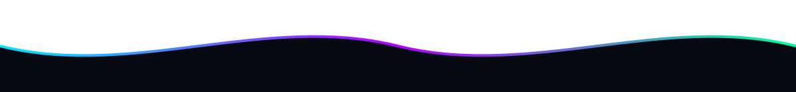

<!-- Areej Zeb — Cybersecurity & AI Engineer -->

  

  <strong>Cybersecurity Engineer · AI-Powered Security Tools · Full-Stack Developer</strong>

  <a href="https://www.linkedin.com/in/areejzeb">LinkedIn</a> •
  <a href="mailto:areejzeb04@gmail.com">Email</a> •
  <a href="https://github.com/Areej-zeb">GitHub</a>

  

## 🧠 Tech Stack

  
  
  
  
  
  

  
  
  
  

  
  
  

  
  
  
  

  

## 🔍 Core Expertise

| Domain | Focus |
|------|------|
| **AI & ML in Security** | NLP-based vulnerability triage, semantic CVE matching, severity classification |
| **Defensive Engineering** | IDS concepts, alert correlation, anomaly detection workflows |
| **Offensive Security** | OWASP API Top 10 testing, brute-force & abuse analysis |
| **Secure Web & APIs** | FastAPI backends, hardened auth, React frontends |
| **Automation & Tooling** | CI/CD security integration, detection orchestration |
| **Distributed Systems** | MPI-based analysis, scalable detection pipelines |

  

## 🚀 Projects (Expand Each)

  
<strong>🛡️ Aegis — Enterprise Threat Detection & Security Advisory</strong>

   
  <pre><code>Repo:
https://github.com/Areej-zeb/Aegis-Enterprise-Threat-Detection-and-Security-Advisory

Overview:
Modular threat detection and advisory platform for security event streams.

Core capabilities:
- Event analysis and normalization
- Alert correlation and prioritization
- Structured advisory-style outputs

Tech:
Python • Detection Logic • Alert Correlation • Security Advisories</code></pre>

  
<strong>🧠 AI-Vulnerability-Scanner</strong>

   
  <pre><code>Repo:
https://github.com/Areej-zeb/AI-Vulnerability-Scanner

Overview:
AI-augmented scanner mapping discovered services to CVEs using embeddings.

Pipeline:
- Service discovery and recon
- Semantic CVE matching (SBERT)
- Severity classification
- Remediation guidance generation

Tech:
Python • FastAPI • Nmap • NLP (SBERT) • Machine Learning • JS/HTML</code></pre>

  
<strong>🧪 ddos-detection-mpi</strong>

   
  <pre><code>Repo:
https://github.com/Areej-zeb/ddos-detection-mpi

Overview:
Distributed traffic anomaly and DDoS detection using MPI.

Highlights:
- Parallel processing across nodes
- Focus on scale and throughput
- Monitoring-oriented detection logic

Tech:
Python • MPI • Distributed Systems • Monitoring</code></pre>

  
<strong>🎨 image-moderation-api</strong>

   
  <pre><code>Repo:
https://github.com/Areej-zeb/image-moderation-api

Overview:
Content and image moderation API for filtering user uploads.

Use cases:
- Pre-upload moderation
- Safety gates for platforms
- Integration into UI workflows

Tech:
Node.js • Express • Content Safety / ML</code></pre>

  
<strong>🔐 owasp-api-vuln-lab</strong>

   
  <pre><code>Repo:
https://github.com/Areej-zeb/owasp-api-vuln-lab

Overview:
Practical API security lab focused on OWASP API Top 10.

Purpose:
- Hands-on learning and demos
- Repeatable vulnerability testing
- ZAP and Postman workflows

Tech:
Postman • OWASP ZAP • API Security Testing</code></pre>

  
<strong>🤖 secure-university-chatbot</strong>

   
  <pre><code>Repo:
https://github.com/Areej-zeb/secure-university-chatbot

Overview:
Secure chatbot designed for university environments.

Security focus:
- Authentication and access control
- Controlled content handling
- Secure-by-default design patterns

Tech:
Node.js • Security Controls • Chat System</code></pre>

  

## 🏆 Certifications

- **CompTIA PenTest+ (PT0-002)**
- **Cisco Ethical Hacking**
- **Google Cybersecurity Certificate**

  

## 📫 Let’s Connect

  <a href="https://www.linkedin.com/in/areejzeb">LinkedIn</a> •
  <a href="mailto:areejzeb04@gmail.com">Email</a> •
  <a href="https://github.com/Areej-zeb">GitHub</a>

  

